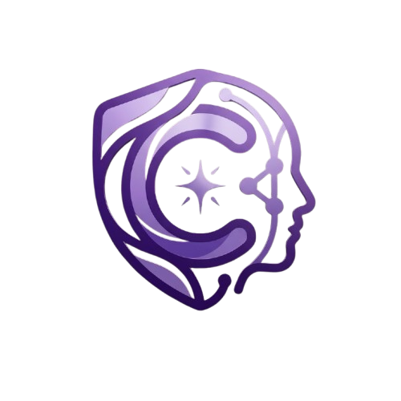

<div align="center">
  

  # Cortex-AI

  **Detección temprana de la enfermedad de Parkinson mediante análisis de voz**

  *Trabajo Fin de Grado — Ingeniería Informática*

  ---

  [](https://www.python.org/)
  [](https://pytorch.org/)
  [](https://fastapi.tiangolo.com/)
  [](https://flutter.dev/)
  [](https://www.docker.com/)
  [](https://huggingface.co/facebook/wav2vec2-large-xlsr-53)

</div>

---

## Tabla de contenidos

1. [Descripción del proyecto](#-descripción-del-proyecto)
2. [Arquitectura del sistema](#-arquitectura-del-sistema)
3. [Resultados](#-resultados)
4. [Stack tecnológico](#-stack-tecnológico)
5. [Estructura del repositorio](#-estructura-del-repositorio)
6. [Instalación y configuración](#-instalación-y-configuración)
7. [Pipeline de entrenamiento](#-pipeline-de-entrenamiento)
8. [Backend — FastAPI](#-backend--fastapi)
9. [Deploy en Raspberry Pi 5](#-deploy-en-raspberry-pi-5)
10. [App móvil — Flutter](#-app-móvil--flutter)
11. [Modelos cloud — Modal.com](#-modelos-cloud--modalcom)
12. [Explicabilidad](#-explicabilidad)

---

## Descripción del proyecto

**Cortex-AI** es un sistema de detección temprana de la enfermedad de Parkinson a partir de grabaciones de voz. El sistema cubre el ciclo completo: desde la extracción de características acústicas hasta la inferencia en tiempo real en un dispositivo embebido (Raspberry Pi 5), pasando por una app móvil multiplataforma.

### Datasets utilizados

| Dataset | Pacientes | Grabaciones | Características |
|---------|-----------|-------------|-----------------|
| **NeuroVoz** | 107 | ~2 000 | Vocales sostenidas, frases, habla espontánea |
| **PC-GITA** | 100 | ~2 032 | Vocales sostenidas, frases, habla espontánea |
| **Combinado** | 207 | **4 032** | Fusión estratificada (80/20 por paciente) |

> Los audios **no** están incluidos en el repositorio. Ver [Instalación](#-instalación-y-configuración) para obtenerlos.

---

## Arquitectura del sistema

```
┌─────────────────────────────────────────────────────┐
│              App Flutter (iOS / Android)             │
│   Grabación vocal · Selección de modelo · Resultados │
└─────────────────────┬───────────────────────────────┘
                      │  HTTP / REST  (puerto 9000)
         ┌────────────▼────────────┐
         │   Raspberry Pi 5 (8 GB) │
         │   Docker · FastAPI      │
         │                         │
         │  ┌─────────────────┐    │    ┌──────────────────────┐
         │  │  Modelos locales │    │    │  Modal.com (cloud)   │
         │  │  ─────────────  │    │───▶│  ─────────────────── │
         │  │  KNN acústico   │    │    │  Wav2Vec2 embeddings  │
         │  │  XGBoost        │    │    │  Wav2Vec2 finetune    │
         │  │  ResNet18       │    │    │  (GPU serverless)     │
         │  └─────────────────┘    │    └──────────────────────┘
         └─────────────────────────┘
```

### Flujo de inferencia

```
Audio (WAV/M4A)
   │
   ▼
Preprocesamiento          → noisereduce, normalización, recorte de silencios
   │
   ├─ Features acústicas  → Parselmouth/Praat: Shimmer, Jitter, HNR, CPPS, …
   │      └──▶ KNN / XGBoost  ──▶ probabilidad EP
   │
   ├─ Mel-espectrograma   → librosa (N_MEL=65, frame=1 s, hop=0.5 s)
   │      └──▶ ResNet18   ──▶ probabilidad EP + Grad-CAM
   │
   └─ Embeddings Wav2Vec2 → facebook/wav2vec2-large-xlsr-53
          └──▶ PCA (95%) + KNN / XGBoost  ──▶ probabilidad EP
```

---

## Resultados

> Evaluación en **holdout externo** (20% pacientes nunca vistos durante el entrenamiento).  
> Métrica principal: **Balanced Accuracy (BA)** — robusta ante desequilibrio de clases.

| Modelo | Actividad | Condición | BA | AUC-ROC |
|--------|-----------|-----------|:--:|:-------:|
| **ResNet10** | all | con edad | **0.833** | 0.868 |
| Wav2Vec + KNN | all | con edad | 0.810 | **0.943** |
| Wav2Vec + XGBoost | frase | con edad | 0.857 | 0.939 |
| **KNN acústico** *(producción)* | frase | **sin edad** | **0.833** | 0.873 |
| KNN acústico | all | sin edad | 0.810 | 0.859 |
| ResNet18 (specaugment) | all | con edad | 0.762 | 0.823 |

> **Modelo en producción:** `KNN sin_age/frase` — 5 features acústicas, sin variables demográficas (evita confound de edad en NeuroVoz, donde EP ≈ 71 años vs HC ≈ 64 años).

---

## Stack tecnológico

<div align="center">

| Capa | Tecnología | Uso |
|------|-----------|-----|
| **Lenguaje** |  | Todo el backend y ML |
| **Package manager** |  | Gestión de dependencias ultrarrápida |
| **Deep Learning** |  | ResNet18/10, Wav2Vec2 fine-tuning |
| **Modelos clásicos** |   | KNN, XGBoost |
| **Audio** |   | Features acústicas y espectrogramas |
| **Modelos fundacionales** |  | Embeddings pre-entrenados |
| **API** |  | Backend REST con docs automáticas |
| **Explicabilidad** |   | Interpretabilidad clínica |
| **App móvil** |  | iOS / Android |
| **Contenedores** |  | Deploy reproducible en RPi5 |
| **Hardware** |  | Servidor edge (8 GB RAM) |
| **Cloud** |  | GPU serverless para Wav2Vec2 |
| **CI/CD** |  | Builds automáticos iOS |

</div>

---

## Estructura del repositorio

```
Cortex-AI/
├── src/                          # Pipeline de entrenamiento
│   ├── config.py                 # Parámetros globales (SR=16kHz, seed, paleta)
│   ├── data/
│   │   ├── preprocess_audio.py   # Normalización, recorte de silencios
│   │   └── build_combined_dataset.py  # Fusión NeuroVoz + PC-GITA
│   ├── features/
│   │   ├── acoustic.py           # Extracción Parselmouth/Praat
│   │   ├── spectrograms.py       # Mel-espectrogramas (frame=1s, hop=0.5s)
│   │   ├── embeddings.py         # Embeddings Wav2Vec2 (xlsr-53)
│   │   └── split_dataset.py      # Split 80/20 estratificado por paciente
│   ├── models/
│   │   ├── train_knn.py          # KNN acústico (flag --no-age)
│   │   ├── train_xgboost.py      # XGBoost acústico (flag --no-age)
│   │   ├── train_resnet.py       # ResNet18 sobre mel-specs (--freeze, --age-match)
│   │   ├── train_resnet10.py     # ResNet10 (ablación)
│   │   ├── train_cnn.py          # CortexCNN (ablación)
│   │   ├── train_wav2vec.py      # Embeddings congelados + KNN/XGBoost
│   │   └── train_wav2vec_finetune.py  # Fine-tuning end-to-end
│   └── utils/
│       └── results_logger.py     # Guarda JSONs y genera tabla LaTeX
│
├── backend/                      # API de inferencia
│   ├── main.py                   # FastAPI app (endpoints /predict, /health)
│   ├── config.py                 # Rutas de modelos, variables de entorno
│   ├── schemas.py                # Pydantic models (request/response)
│   └── inference/
│       ├── local.py              # KNN, XGBoost, ResNet18 + Grad-CAM
│       ├── cloud.py              # Proxy asíncrono → Modal.com
│       └── extractor.py          # Preprocesamiento + extracción de features
│
├── cloud/
│   └── modal_app.py              # Servidor GPU serverless (Wav2Vec2)
│
├── frontend/                     # App Flutter
│   ├── lib/
│   │   ├── core/                 # API client, providers, theme
│   │   └── features/             # Pantallas: home, recording, result, settings
│   └── assets/
│       └── logo.png
│
├── deploy/
│   ├── Dockerfile                # Python 3.11-slim + libsndfile + ffmpeg
│   ├── docker-compose.yml        # Servicio cortex-api (puerto 9000)
│   └── requirements-rpi.txt      # Deps sin CUDA para ARM64
│
├── bats/
│   ├── lanzar_todo.bat           # Pipeline completo (todos los modelos)
│   ├── lanzar_resnet_noche.bat   # ResNet18 + CNN + ResNet10
│   ├── lanzar_wav2vec_finetune.bat  # Fine-tuning (12-38h, GPU)
│   └── lanzar_embeddings.bat     # Embeddings Wav2Vec2
│
├── pyproject.toml                # Dependencias (uv)
└── uv.lock
```

> **Nota:** Los directorios `data/`, `models/`, `reports/` y `notebooks/` están en `.gitignore` — los pesos entrenados y los audios no se distribuyen en el repositorio.

---

## Instalación y configuración

### Prerrequisitos

- Python 3.11+
- [uv](https://docs.astral.sh/uv/) (gestor de paquetes)
- CUDA 12.4+ (para entrenamiento con GPU)
- Git

### 1. Clonar el repositorio

```bash
git clone https://github.com/jcalvente083/Cortex-AI.git
cd Cortex-AI
```

### 2. Instalar dependencias (GPU)

```bash
# uv crea el entorno virtual y resuelve dependencias automáticamente
uv sync
```

> Para **CPU only** (sin CUDA), edita `pyproject.toml` y cambia el índice de PyTorch a `https://download.pytorch.org/whl/cpu`.

### 3. Obtener los datasets

Descarga los datasets y colócalos en:

```
data/raw/
├── NeuroVoz/          # https://zenodo.org/records/8075649
│   ├── HC/            # Controles sanos
│   └── PD/            # Pacientes con Parkinson
└── PC-GITA/           # https://www.ifc.unam.mx/labsf/pc-gita
    ├── HC/
    └── PD/
```

---

## Pipeline de entrenamiento

El pipeline completo se ejecuta con un único script:

```powershell
# Windows — lanza todos los modelos y genera la tabla LaTeX
.\bats\lanzar_todo.bat 2>&1 | Tee-Object -FilePath "logs\run_$(Get-Date -Format 'yyyyMMdd_HHmmss').txt"
```

O paso a paso:

### Paso 1 — Preprocesamiento de audio

```bash
uv run python -m src.data.preprocess_audio
uv run python -m src.data.build_combined_dataset
```

### Paso 2 — Extracción de características

```bash
# Features acústicas (Parselmouth/Praat)
uv run python -m src.features.acoustic

# Mel-espectrogramas (frame=1s, hop=0.5s, N_MEL=65)
uv run python -m src.features.spectrograms

# Embeddings Wav2Vec2 (requiere GPU o tiempo considerable en CPU)
uv run python -m src.features.embeddings

# Split train/test estratificado 80/20 por paciente
uv run python -m src.features.split_dataset
```

### Paso 3 — Entrenamiento de modelos

#### Modelos acústicos clásicos

```bash
# KNN — sin variables demográficas (modelo de producción)
uv run python -m src.models.train_knn --run sin_age --no-age

# KNN — con edad y sexo
uv run python -m src.models.train_knn --run con_age

# XGBoost — sin variables demográficas
uv run python -m src.models.train_xgboost --run sin_age --no-age

# XGBoost — con edad y sexo
uv run python -m src.models.train_xgboost --run con_age
```

#### Modelos sobre espectrogramas (ResNet)

```bash
# ResNet18 — SpecAugment + pesos congelados (ImageNet)
uv run python -m src.models.train_resnet --run specaugment_freeze --freeze

# ResNet18 — Age-matched + pesos congelados
uv run python -m src.models.train_resnet --run age_matched_freeze --age-match --freeze

# ResNet10 — ablación
uv run python -m src.models.train_resnet10 --run specaugment_freeze --freeze

# CortexCNN — ablación
uv run python -m src.models.train_cnn --run baseline
```

#### Modelos Wav2Vec2

```bash
# Embeddings congelados + KNN/XGBoost (PCA dinámica al 95% de varianza)
uv run python -m src.models.train_wav2vec --run baseline
uv run python -m src.models.train_wav2vec --run age_matched --age-match

# Fine-tuning end-to-end (requiere GPU ≥ 8 GB VRAM, ~1-3 días)
uv run python -m src.models.train_wav2vec_finetune --run baseline --epochs 30
```

### Paso 4 — Generar tabla de resultados

```bash
# Lee todos los JSONs en reports/results/ y genera tabla LaTeX comparativa
uv run python -m src.utils.results_logger --set holdout_external --output reports/results/tabla_resultados.tex
```

### Flags de control demográfico

| Modelo | Flag | Efecto |
|--------|------|--------|
| `train_knn`, `train_xgboost` | `--no-age` | Elimina Age/Sex como features (evita confound) |
| `train_resnet`, `train_wav2vec` | `--age-match` | Matching 1:1 (±5 años) en NeuroVoz |
| `train_resnet`, `train_wav2vec` | `--freeze` | Congela capas de ImageNet (transfer learning) |

---

## Backend — FastAPI

### Lanzar en local

```bash
uv run uvicorn backend.main:app --host 0.0.0.0 --port 8000 --reload
```

Documentación interactiva disponible en `http://localhost:8000/docs`.

### Endpoints

| Método | Endpoint | Descripción |
|--------|----------|-------------|
| `GET` | `/health` | Estado del servidor y modelos cargados |
| `GET` | `/modelos` | Lista de modelos disponibles y capacidades |
| `POST` | `/predict` | Inferencia con un único audio |
| `POST` | `/predict/batch` | Inferencia con 3 audios (vocal + frase + espontánea) |

### Ejemplo de uso

```bash
# Health check
curl http://localhost:8000/health

# Predicción con un audio
curl -X POST http://localhost:8000/predict \
  -F "audio=@grabacion.wav" \
  -F "modelo=knn" \
  -F "actividad=frase"
```

**Respuesta:**
```json
{
  "probabilidad_ep": 0.73,
  "nivel_riesgo": "Alto",
  "modelo": "knn",
  "explicabilidad": {
    "tipo": "feature_deviation",
    "features": ["ShimmerDb", "ATRI", "Hnr", "CHNR", "rPPQ"],
    "valores": [0.82, -0.31, 0.54, 0.67, -0.12]
  }
}
```

### Variables de entorno

| Variable | Por defecto | Descripción |
|----------|-------------|-------------|
| `CLOUD_API_URL` | *(vacío)* | URL del servidor Modal.com (Wav2Vec2) |

---

## Deploy en Raspberry Pi 5

### Requisitos

- Raspberry Pi 5 (8 GB RAM recomendado)
- Docker + Docker Compose instalados
- Pesos de los modelos en `~/cortex-ai/models/`

### Estructura de modelos esperada en la RPi

```
models/
├── traditionals/
│   ├── KNN/sin_age/{vocal,frase,espontanea,all}/
│   └── XGBoost/sin_age/{vocal,frase,espontanea,all}/
└── resnet/
    └── ResNet18/specaugment_v2/{vocal,frase,espontanea,all}/
```

### Desplegar

```bash
cd ~/cortex-ai/deploy

# Primera vez o tras cambios de código
docker compose up -d --build

# Reiniciar (recarga modelos)
docker compose restart

# Ver logs en tiempo real
docker compose logs -f

# Health check
curl http://localhost:9000/health
```

### Configuración del puerto

La API queda expuesta en el **puerto 9000** del host (mapeado desde 8000 del contenedor). La app Flutter apunta a `http://<IP-RPi>:9000`.

---

## App móvil — Flutter

### Requisitos

- Flutter SDK ≥ 3.0
- Xcode (iOS) o Android Studio (Android)

### Instalación

```bash
cd frontend
flutter pub get
```

### Ejecutar en desarrollo

```bash
# Android
flutter run -d android

# iOS (requiere Mac + Xcode)
flutter run -d ios

# Web
flutter run -d chrome
```

### Construir release

```bash
# Android APK
flutter build apk --release

# iOS IPA (requiere cuenta Apple Developer)
flutter build ipa --release
```

### Configurar servidor

En la app → **Ajustes** → introduce la IP y puerto del servidor (ej. `http://192.168.1.50:9000`).

### Pantallas principales

| Pantalla | Descripción |
|----------|-------------|
| **Home** | Selección de modelo y actividad vocal |
| **Grabación** | 3 grabaciones secuenciales (vocal, frase, espontánea) |
| **Resultado** | Gauge de riesgo + gráfica de explicabilidad |
| **Info** | Descripción del proyecto y aviso médico |
| **Ajustes** | URL del servidor, idioma, historial |

---

## Modelos cloud — Modal.com

Los modelos Wav2Vec2 requieren GPU y son demasiado pesados para la RPi. Se sirven desde **Modal.com** de forma serverless.

### Setup inicial (una vez)

```bash
pip install modal
modal setup          # Autenticación con cuenta Modal
modal volume create cortex-models

# Subir pesos al volumen persistente
modal volume put cortex-models models/wav2vec/ /models/wav2vec/
```

### Deploy

```bash
modal deploy cloud/modal_app.py
# → URL estable: https://<usuario>--cortex-ai-predict.modal.run
```

### Conectar con la RPi

```bash
# En la RPi, configurar la variable de entorno
echo "CLOUD_API_URL=https://<usuario>--cortex-ai-predict.modal.run" >> ~/cortex-ai/deploy/.env
docker compose up -d --build
```

---

## Explicabilidad

Cortex-AI implementa técnicas de XAI (*Explainable AI*) para proporcionar transparencia clínica:

| Modelo | Método | Descripción |
|--------|--------|-------------|
| **KNN acústico** | Feature Deviation | Z-score + tanh → desviación de cada feature respecto a la media |
| **XGBoost** | SHAP TreeExplainer | Valores SHAP exactos para importancia de features |
| **ResNet18** | Grad-CAM | Mapa de calor sobre el mel-espectrograma (capa `layer4[-1]`) |
| Wav2Vec2 | Oclusión temporal | *(pendiente de implementar)* |

La explicabilidad se devuelve en el mismo JSON de predicción y se visualiza en la app mediante gráficas de barras (SHAP/Feature Deviation) o heatmaps sobre el espectrograma (Grad-CAM).

---

<div align="center">

**Jesús David Calvente Zapata** · TFG Ingeniería Informática · 2026

*Este sistema es una herramienta de investigación y apoyo clínico. No reemplaza el diagnóstico médico profesional.*

</div>
