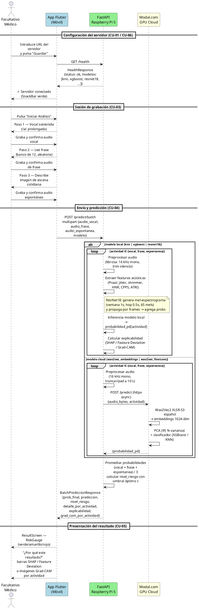

# Diagrama de Secuencia — Cortex-AI

PlantUML para el diagrama de secuencia del caso de uso principal (`POST /predict/batch`).

## Cómo renderizarlo

- **Online:** pegar el bloque en [plantuml.com/plantuml](https://www.plantuml.com/plantuml/uml/)
- **VS Code:** extensión `PlantUML` (requiere Java)
- **CLI:** `java -jar plantuml.jar diagrama_secuencia.md` → genera PNG

Una vez exportado como PNG, guardarlo en `docs/Memoria/imagenes/anexos/diagrama_secuencia.png` y reemplazar en `software.tex` el placeholder por:
```latex
\includegraphics[width=0.9\textwidth]{imagenes/anexos/diagrama_secuencia.png}
```

---

## Código PlantUML


